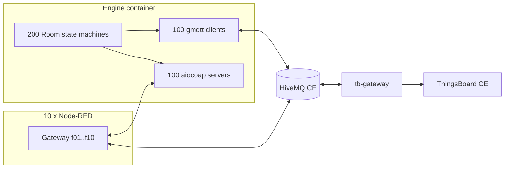

# IoT App Devs – Phase 2 Report

**Project name:** Distributed Intelligent Campus (Hybrid MQTT + CoAP)

| Field | Value |
|--------|--------|
| Course | SWAPD453 – IoT Apps Devs, Spring 2026 |
| Phase | 2 – MQTT & CoAP Infrastructure & Processing |
| Repository | (your GitHub URL) |
| Team | Student 1: ___ Name ___, ID ___ · Student 2: ___ · Student 3: ___ · Student 4: ___ |
| Date | ___ |

*Use the official cover page from the course pack for the PDF you upload to Google Classroom. This file is the technical body of the Phase 2 deliverable.*

---

## Table of contents

1. [Purpose and scope](#1-purpose-and-scope)  
2. [Mapping to Phase 2 criteria (course PDF)](#2-mapping-to-phase-2-criteria-course-pdf)  
3. [System architecture](#3-system-architecture)  
4. [Edge: hybrid world engine (Python + asyncio)](#4-edge-hybrid-world-engine-python--asyncio)  
5. [Fog: floor gateways (Node-RED)](#5-fog-floor-gateways-node-red)  
6. [Cloud: HiveMQ + ThingsBoard (on premises)](#6-cloud-hivemq--thingsboard-on-premises)  
7. [Northbound and southbound data paths](#7-northbound-and-southbound-data-paths)  
8. [Reliability, QoS, and deduplication](#8-reliability-qos-and-deduplication)  
9. [Security and identity](#9-security-and-identity)  
10. [Performance and monitoring methodology](#10-performance-and-monitoring-methodology)  
11. [Deliverable file index (repository)](#11-deliverable-file-index-repository)  
12. [How to run and verify](#12-how-to-run-and-verify)  
13. [Scope notes (CE vs PE, Wokwi)](#13-scope-notes-ce-vs-pe-wokwi)  
14. [References](#14-references)  

---

## 1. Purpose and scope

This report describes **Phase 2** of the *Distributed Intelligent Campus* project: a **200-room** simulated campus (1 building, 10 floors, 20 rooms per floor) using **100 MQTT clients** and **100 CoAP servers** in one **asyncio** process, **10 Node-RED floor gateways**, a **HiveMQ Community Edition** broker, and **ThingsBoard Community Edition** for provisioning, rules, and dashboards. The Phase 1 **deterministic room physics** (thermal model, faults, heartbeats) is unchanged in spirit; only the **transport and orchestration** layer is split into dual protocols and enterprise components.

**Out of scope for this report (covered in other phases or course rules):** Phase 3 persistence (TDB), Phase 4 chaos testing, and **Wokwi** (Phase 1 reference room POC). Wokwi is **not** a Phase 2 implementation requirement; it may remain in the repo as Phase 1 evidence.

---

## 2. Mapping to Phase 2 criteria (course PDF)

| Criterion (Phase 2 description) | How this project satisfies it |
|----------------------------------|------------------------------|
| **100 MQTT nodes** – gmqtt, persistent TCP, unique ClientID, LWT | `engine/transport/mqtt_transport.py` – one client per room; LWT on `.../status` (see `config/config.yaml` topics) |
| **100 CoAP nodes** – aiocoap, Observable resources (RFC 7641) | `engine/transport/coap_transport.py` – per-room UDP port `5684 + (floor-1)*10 + index` (see `engine/main.py` / config) |
| **Physics** piped into both stacks | `engine/room.py` `to_telemetry_json()`; same `Room` state drives MQTT publish and CoAP Observe |
| **10 gateways**, 20 rooms each (10 MQTT + 10 CoAP) | `docker-compose.yml` `gateway-f01` … `gateway-f10`; flows `gateways/flows/gw_f01.json` … `gw_f10.json` |
| **HiveMQ** as campus MQTT backbone | Service `hivemq`, host port **1885** → container **1883** |
| **ThingsBoard** on prem | Service `thingsboard` UI (default **9090**) |
| **“Remote observer”** – cloud subscribes via MQTT without rooms talking to TB directly | **CE:** **ThingsBoard IoT Gateway** (`tb-gateway`) subscribes HiveMQ and forwards to TB APIs (PE “Platform Integration” is **not** in CE) |
| **CoAP → cloud pipeline** (Observe → gateway → MQTT → TB) | Node-RED republishes to `campus/b01/f##/r###/telemetry` (same as native MQTT) |
| **200 devices, asset tree, relations** | `infra/thingsboard/bootstrap.py` → Campus → Building → Floor → Room, devices + `devices.csv` |
| **Rule engine / alarms** | Declarative **HighTemp** on device profiles in bootstrap; optional `infra/thingsboard/rule-chain-alarms.json` |
| **NOC / fleet dashboard** | `infra/thingsboard/dashboard-noc.json` (import in TB UI) |
| **Node-RED** – dual protocol, command mapping, **edge thinning** | Flows: MQTT in/out, CoAP Observe, `coap` PUT for commands, floor `summary` where implemented |
| **Commands** – MQTT QoS 2; CoAP CON / PUT; responses on `.../response` | `qos_command: 2` in config; engine + gateway handle cmd topics |
| **Deduplication (DUP)** | `engine/transport/dup_filter.py` + handling in MQTT/CoAP transports |
| **Security** – TLS, DTLS, ACLs, per-node identity | `infra/hivemq/conf/credentials.xml`, `infra/certs/`, `config` flags – **see §9 (defaults are optional)** |
| **Performance evidence** | `tests/test_benchmark.py`, `tools/rtt_benchmark.py` – **capture logs/screens for your PDF** |
| **Docker Compose** unified stack | `docker-compose.yml` |
| **~5 page performance/reliability report** | This document + your screenshots and measured tables fill that deliverable when exported to PDF |

---

## 3. System architecture

The stack has three layers:

1. **Edge** – One **World Engine** container: **200 asyncio tasks** (conceptually 100 MQTT + 100 CoAP transports attached to 200 `Room` instances with shared configuration from `config/config.yaml`).

2. **Fog** – **Ten** Node-RED **gateway-f{01..10}** containers. Each subscribes to **HiveMQ** for its floor’s MQTT topics, **observes** ten CoAP rooms on the **engine** host, translates **southbound** commands from MQTT to **CoAP PUT** where required, and can publish **floor summaries** and **offline** hints when the cloud path is unhealthy.

3. **Cloud (local)** – **HiveMQ CE** aggregates MQTT; **ThingsBoard CE** ingests data via **tb-gateway** (not the PE Integrations UI). Operators use the **ThingsBoard** web UI for devices, assets, alarms, and dashboards.

**Unified topic namespace (MQTT):** `campus/b01/f{ff}/r{rrr}/telemetry|heartbeat|cmd|response|status` and `campus/b01/f{ff}/summary`. **CoAP URI pattern (to engine):** `coap://engine:{port}/f{ff}/r{rrr}/telemetry` (and actuator paths as in flows).

---

## 4. Edge: hybrid world engine (Python + asyncio)

| Topic | Location / behavior |
|--------|---------------------|
| **Entry point** | `engine/main.py` – loads YAML, starts room tasks, drift-aware `asyncio.sleep` (no `time.sleep` on hot path) |
| **Room model** | `engine/room.py` – identity `b01-f{floor}-r{room_code}`, JSON telemetry, `thingsboard_device_profile()` → MQTT vs CoAP **profile** by room index |
| **Physics / faults** | `engine/physics/`, `engine/faults/` – Newton-style cooling, HVAC modes, fault injection, configurable rates |
| **Persistence** | SQLite `world.db` (path in config) – periodic sync, restore on start |
| **MQTT** | `engine/transport/mqtt_transport.py` – gmqtt, QoS for telemetry/heartbeat/cmd per config |
| **CoAP** | `engine/transport/coap_transport.py` – Observe, PUT handlers for actuators, CON where applicable for alerts |
| **Dockerfile** | Engine image used by `docker-compose` `engine` service |

**Rubric alignment:** 100+100 tasks, gmqtt, aiocoap Observe, non-blocking I/O, Phase 1 physics carried forward.

---

## 5. Fog: floor gateways (Node-RED)

| Topic | Location |
|--------|----------|
| **Flow exports (10 files)** | `gateways/flows/gw_f01.json` … `gateways/flows/gw_f10.json` |
| **Generator** | `gateways/gen_flows.py` (regenerate flows if topology changes) |
| **Responsibilities** | Subscribe to **floor** MQTT; **CoAP Observe** to each CoAP room on that floor; republish CoAP JSON to the **same** HiveMQ topic tree as native MQTT; forward **cmd** to MQTT subscribers or **CoAP PUT**; **edge thinning** (e.g. moving averages / summary to `.../summary`); **local autonomy** (e.g. command when cloud flag cleared) in flow JS |
| **UIs (debug)** | Host ports **1890–1899** map to each gateway’s Node-RED editor (see `README.md`) |

**Evidence for graders:** In each flow JSON, search for `coap` nodes, `mqtt` in/out, and function nodes that build `campus/b01/...` topics.

---

## 6. Cloud: HiveMQ + ThingsBoard (on premises)

### 6.1 HiveMQ (Community Edition)

- **Role:** Central MQTT bus; all room traffic and gateway traffic passes through it.
- **Host access:** e.g. `localhost:1885` → broker `1883` inside the container; WebSocket **8000** for browser clients.  
- **Control Center:** **HiveMQ CE does not include** the full commercial Control Center web UI. Use `docker compose logs hivemq`, **MQTTX**, or **mosquitto_sub** for connection counts. For the course PDF, if you do not have Enterprise CC, state **“HiveMQ CE – metrics from logs and MQTT bench clients”** and attach a screenshot of **MQTTX** or **subscriber statistics** as proxy evidence.

**ACLs and roles:** `infra/hivemq/conf/credentials.xml` (and `config.xml` as applicable for your deployment) – per-floor users / roles so a floor-01 identity cannot publish to floor-10 topics (verify against your actual broker merge: **note** `docker-compose` comment that CE image may not auto-merge all custom `config.xml` – document what you **actually** run in evaluation).

### 6.2 ThingsBoard (Community Edition)

- **UI:** e.g. `http://localhost:9090` (configurable).  
- **200 devices + hierarchy:** `infra/thingsboard/bootstrap.py` – idempotent; outputs `infra/thingsboard/devices.csv`.  
- **Device profiles:** e.g. `MQTT-ThermalSensor`, `CoAP-ThermalSensor`, `Campus-Gateway-MQTT` for the gateway.  
- **Ingestion path (CE):** **ThingsBoard IoT Gateway** service reads `infra/thingsboard/tb-gateway/tb_gateway.json` and `infra/thingsboard/tb-gateway/mqtt.json` – subscribes to HiveMQ, maps JSON to device names using `sensor_id` and `tb_profile` in payload. This achieves the same **separation of concerns** as a PE “MQTT integration”: the **room devices never hold TB device tokens**; the gateway authenticates to TB.  
- **PE reference (optional):** `infra/thingsboard/integration-hivemq.json` documents a **PE-style** uplink JS converter – **not** used as-is on CE.  
- **Dashboard / rules:** `infra/thingsboard/dashboard-noc.json`, `infra/thingsboard/rule-chain-alarms.json` (import as needed; CE alarm rules on profiles may already suffice).

### 6.3 “Online / offline” story

- **MQTT:** LWT and retained `.../status` (see engine / broker behavior) to mark **disconnect**.  
- **CoAP:** Gateways implement **timeout / stale** behavior so **silent** CoAP rooms can be surfaced as **offline** in MQTT/TB (see `OPERATOR_RUNBOOK.md` and gateway flows).

---

## 7. Northbound and southbound data paths

### 7.1 Northbound (telemetry)

- **Native MQTT room:** `Room` → gmqtt **PUBLISH** `campus/b01/fXX/rYYY/telemetry` (JSON: `sensor_id`, `tb_profile`, `ts` in ms, `timestamp` in s, fields per course table).  
- **CoAP room:** `Room` → **Observe** update on `aiocoap` resource → **Node-RED** → same **topic** and JSON shape on HiveMQ → **tb-gateway** → **ThingsBoard** **room** device. ThingsBoard is intentionally **unaware** that the first hop was CoAP.

### 7.2 Southbound (commands)

- **Flow 1 (MQTT / “listener”):** Dashboard / RPC / rule **→** TB **→** (routing depends on your wiring) **→** HiveMQ `.../cmd` **QoS 2** **→** gmqtt **on_message** in engine **→** actuators **→** `.../response` (and telemetry update).  
- **Flow 2 (CoAP / “proxy”):** `.../cmd` **→** **gateway** subscribes **→** **CoAP PUT** to `coap://engine:port/fXX/rYYY/actuators/...` **→** ACK/response **→** gateway may publish `.../response` for TB.

*Exact widget wiring (e.g. RPC → HiveMQ) is in your `OPERATOR_RUNBOOK.md` and dashboard JSON.*

---

## 8. Reliability, QoS, and deduplication

| Mechanism | Implementation |
|------------|----------------|
| **MQTT command QoS 2** | `config/config.yaml` `qos_command: 2` – PUBREC / PUBREL / PUBCOMP for `.../cmd` |
| **CoAP CON** | Confirmable **PUT/requests** and alert paths in `coap_transport` (see code for sentinel / actuator paths) |
| **DUP / retransmit** | `engine/transport/dup_filter.py` + MQTT `dup` / packet id keys + CoAP token/source keys; gateway-side dedup in flows where present |
| **Stress / balance** | `tools/audit_logs.py` – parse captured HiveMQ (and engine) logs for QoS-2 balance if you run load tests |

**For the PDF deliverable:** paste **one** short log excerpt and **one** `audit_logs` summary table showing balanced counters (or state clearly if a test was not run – honesty is better than placeholder numbers).

---

## 9. Security and identity

| Layer | Mechanism | Where |
|--------|-----------|--------|
| MQTT to broker | Username/password per node, optional **TLS** on port 8883 | `config/config.yaml` `tls_enabled`, `infra/certs/`, `infra/hivemq/` |
| CoAP | Optional **DTLS** + PSK | `coap_dtls` / `infra/certs/coap_psk.json`, `engine/security.py` |
| Isolation | **ACL** roles (e.g. by floor) | `infra/hivemq/conf/credentials.xml` |

**Important:** The **default** `config/config.yaml` in this repository often has **`tls_enabled: false`** and **`dtls_enabled: false`** for **local lab** simplicity. The **rubric** asks for *implementation* and *evidence* of TLS/DTLS. For your submission, either: **(A)** turn both on, regenerate certs, and screenshot a TLS/DTLS handshake, or **(B)** state clearly that **dev mode is plain** and **production** uses the same code paths with flags enabled, and show **one** test capture. Do not claim “all traffic is encrypted” if your demo runs plain MQTT/UDP.

---

## 10. Performance and monitoring methodology

**Course targets (indicative):** event loop &lt; 200 ms under load, RTT (command to visible telemetry) &lt; **500 ms** at 100% simulation load, **5-minute** stress with **no** unexplained message loss, **30+ minute** run stability.

| Activity | How to reproduce | Artifact for PDF |
|----------|------------------|------------------|
| **200 rooms, 5 s tick, sustained run** | `docker compose up`, engine on; optional `python -m engine.main` with env for broker | Screenshot: TB **Latest telemetry** or NOC; engine logs |
| **Event loop** | `tests/test_benchmark.py` (adjust broker env) or internal metrics in engine | Table: p95 latency or “PASS” from script output |
| **RTT** | `python tools/rtt_benchmark.py --count 100 --hivemq-host localhost --hivemq-port 1885` | `tools/out/rtt_histogram.png`, `rtt_results.csv`, summary line |
| **Packet integrity** | `tools/audit_logs.py` with `docker compose logs hivemq` redirected to file | Table: PUBLISH vs PUBREC vs … balanced |
| **HiveMQ “Pulse”** | *Not in CE* – use **log + MQTTX** or Enterprise | Label figure **“Connection overview (CE substitute)”** |

**Do not** copy the **illustrative** sample numbers from older drafts into the PDF if you did not measure them. Replace with your **own** run outputs.

---

## 11. Deliverable file index (repository)

| Phase 2 deliverable (from course PDF) | Path(s) in this repository |
|--------------------------------------|----------------------------|
| Hybrid world engine (asyncio, 100+100) | `engine/`, `requirements.txt`, `Dockerfile` (engine) |
| Gateway flows (10) | `gateways/flows/gw_f01.json` … `gw_f10.json` |
| ThingsBoard provisioning / hierarchy / devices | `infra/thingsboard/bootstrap.py`, `infra/thingsboard/devices.csv` (generated) |
| ThingsBoard **gateway** + HiveMQ **mapping** | `infra/thingsboard/tb-gateway/tb_gateway.json`, `mqtt.json` |
| Dashboard / rules (as applicable) | `infra/thingsboard/dashboard-noc.json`, `rule-chain-alarms.json` |
| **PE reference** integration (not used on CE) | `infra/thingsboard/integration-hivemq.json` |
| Docker stack | `docker-compose.yml` |
| HiveMQ ACLs / config | `infra/hivemq/conf/` |
| Certs / PSK | `infra/certs/` |
| RTT + audit tools | `tools/rtt_benchmark.py`, `tools/audit_logs.py` |
| Operator instructions | `docs/OPERATOR_RUNBOOK.md` |
| Phase 1 / overview | `README.md` |

---

## 12. How to run and verify (short)

1. `docker compose up --build`  
2. Wait for ThingsBoard healthy (~60 s first boot).  
3. `python infra\thingsboard\bootstrap.py --url http://localhost:9090 --user tenant@thingsboard.org --password tenant`  
   (Optional) `--touch-telemetry` for immediate **Active** devices – see `OPERATOR_RUNBOOK.md` (includes CoAP / HiveMQ touch).  
4. Import `dashboard-noc.json` in TB; confirm **tb-gateway** is **Up** and subscribed.  
5. Run `python tools\rtt_benchmark.py --hivemq-host localhost --hivemq-port 1885 --count 100` with stack running.  

**Manual inject:** `python scripts\send_campus_telemetry.py b01-f01-r101` (or any room id) to HiveMQ for a quick northbound test.

---

## 13. Scope notes (CE vs PE, Wokwi)

- **ThingsBoard CE** does not include the **Platform Integrations** center; **tb-gateway** is the supported **CE** path to mirror “subscribe HiveMQ → ThingsBoard.”  
- **`integration-hivemq.json`** is useful as **design documentation** and for **PE**; do not tell graders CE has that UI.  
- **Wokwi** is **Phase 1**; no extra Wokwi work is **required** for **Phase 2** unless your instructor conflates deliverables.  
- **“Digital twin / ML”** in the course project **intro** is **not** implemented as a separate ML pipeline in this repo through Phase 2; the **200 Room** state objects are the **operational** twin of the building.

---

## 14. References

- Course PDF: *SWAPD453 IoT App Dev Project 1* (Phase 1 & 2 sections).  
- ThingsBoard: https://thingsboard.io/  
- ThingsBoard IoT Gateway: https://thingsboard.io/docs/iot-gateway/  
- HiveMQ: https://www.hivemq.com/  
- CoAP: RFC 7252; Observe: RFC 7641  
- In-repo: `docs/OPERATOR_RUNBOOK.md`, `README.md`, `REPORT.md` (if present)  

---

*End of Phase 2 technical report. Export to PDF, add the official cover page, and attach your measured screenshots, RTT table, and (if applicable) HiveMQ/ThingsBoard evidence.*
